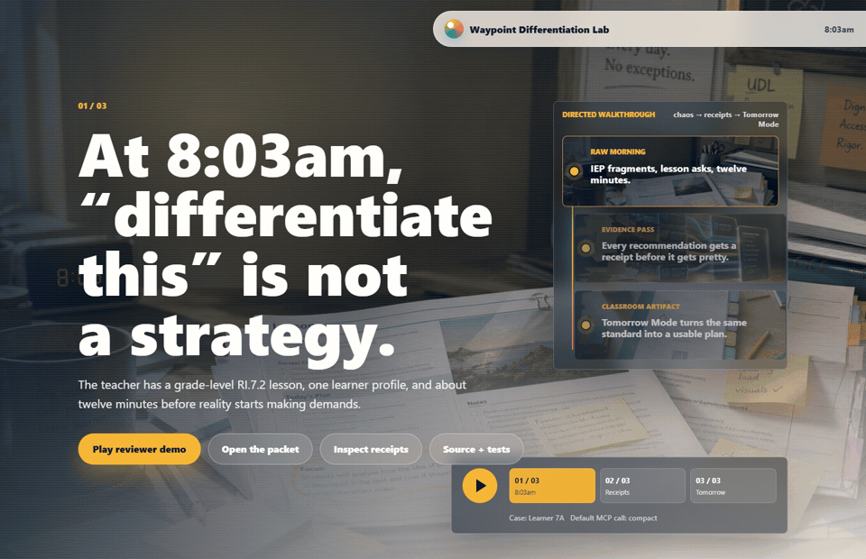

# Waypoint Differentiation Lab

Turn a lesson map and a pseudonymized learner profile into tomorrow's classroom supports, with receipts attached to every recommendation.



## Open the visual walkthrough

[Open the live reviewer walkthrough](https://cuuper22.github.io/waypoint-differentiation-lab/) or run it locally from `showcase/`. It is the fast reviewer path: a three-act cinematic walkthrough, packet preview, Receipts Rail, quality gate, lightweight MCP architecture, and five-minute review scorecard in one browser pass. Click **Play reviewer demo** for the guided version.

```bash
npm ci
npm run demo
npm run showcase:dev
```

Open `http://127.0.0.1:5173/`.

For a terminal-sized MCP walkthrough without opening a client:

```bash
npm run demo:reviewer
```

For the full local submission check, including visual QA that starts the showcase server when needed:

```bash
npm run submission:check
```

## Run the MCP

```bash
npm run build
npm run dev
```

Stdio smoke test without opening a desktop client:

```bash
npm run smoke:mcp
```

Claude Desktop example:

```json
{
  "mcpServers": {
    "waypoint-differentiation-lab": {
      "command": "node",
      "args": ["/absolute/path/to/waypoint-differentiation-lab/dist/server.js"]
    }
  }
}
```

Resources:

- `learner-profile` at `waypoint://case/learner-7a/profile`
- `community-lesson-map` at `waypoint://lesson/community/map`
- `sample-teacher-packet` at `waypoint://packet/community/learner-7a`
- `teacher-handout` at `waypoint://packet/community/learner-7a/handout`

Tools:

- `generate_teacher_packet`: builds a deterministic Tomorrow Mode packet for 5, 15, or 45 minutes of prep. Defaults to `detail: "compact"` so clients get IDs and short actions first.
- `explain_modification`: returns a short receipt in `content` and the full Receipts Rail trace in `structuredContent`.
- `review_packet_quality`: runs the No Hand-Wavy Accommodations Detector with a small text verdict plus structured flags.
- `get_learner_profile`, `get_lesson_map`, and `explain_evidence`: expose the underlying planning context without dumping raw JSON into the text channel.
- `render_evidence_audit`: defaults to a compact ref index; pass `detail: "full"` for the quote-level Markdown table.

## Inspect the evidence

The generated artifacts come from the same TypeScript packet builder:

- `examples/teacher-handout.md`
- `examples/evidence-audit.md`
- `examples/reviewer-workflow.md`
- `examples/quality-report.json`
- `examples/compact-packet.json`
- `examples/sample-packet.json`
- `showcase/src/generated-data.js`

Every recommendation carries:

- IEP-derived source quote
- lesson demand
- UDL alignment
- barrier addressed
- support type
- preserved standard: `RI.7.2`
- progress check

The quality gate fails recommendations that are vague, unsupported, lowered in rigor, missing matching materials, or unsafe for student-facing language.

The MCP surface is intentionally light by default. Compact packet output is tested to stay under 30% of the full packet JSON, every public tool must advertise a non-empty object output schema, the tool catalog itself is smoke-tested under a 15,000-character startup budget, tool text responses are smoke-tested against tight character budgets, quote-level evidence stays behind `explain_modification`, and the full audit table stays behind `render_evidence_audit({ detail: "full" })` until a client actually needs it.

## Why this shape

Waypoint's public product framing emphasizes saving special education teachers time, targeted instructional resources, progress monitoring, and teacher review. The challenge asks for output quality, architecture decisions, code quality, and domain understanding, not a giant ingestion theater. CAST's UDL framing keeps the supports grounded in representation, engagement, and action/expression instead of name-dropping a framework and wandering off.

Links:

- [Waypoint Learning](https://trywaypointlearning.com/)
- [Waypoint challenge](https://github.com/igoldstein19/waypoint-challenge/)
- [CAST UDL overview](https://www.cast.org/resources/about-universal-design-for-learning/)

## Verify

```bash
npm run submission:check
```

That runs TypeScript build, Vitest, artifact generation, the showcase production build, an MCP stdio smoke test, browser QA, and the compact MCP reviewer workflow.
